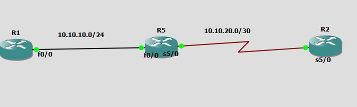

# EIGRP



# R1
```
interface fastEthernet 0/0
ip address 10.10.10.1 255.255.255.252
no sh


router eigrp 2
eigrp router-id 1.1.1.1
network 10.10.10.0 0.0.0.3
```


# R5 
```

interface fastEthernet 0/0
ip address 10.10.10.2 255.255.255.252
no sh

interface serial 5/0
no sh
ip address 10.10.20.2 255.255.255.252


router eigrp 2
eigrp router-id 5.5.5.5
network 10.10.10.0 0.0.0.3
network 10.10.20.0 0.0.0.3
no auto-summary
```


# R2

```
interface serial 5/0
no sh
ip address 10.10.20.1 255.255.255.252


router eigrp 2
eigrp router-id 2.2.2.2
network 10.10.20.0 0.0.0.3
no auto-summary


```